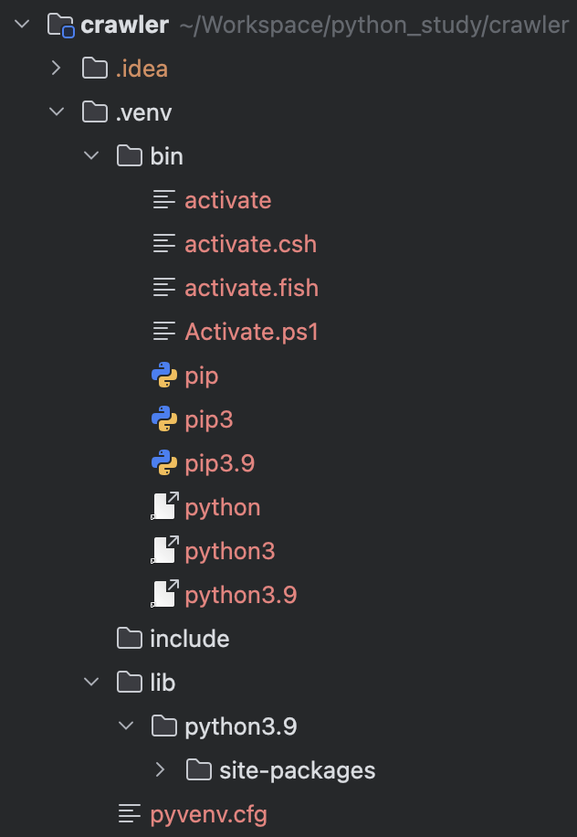
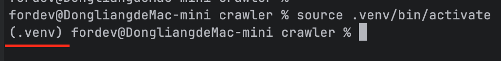
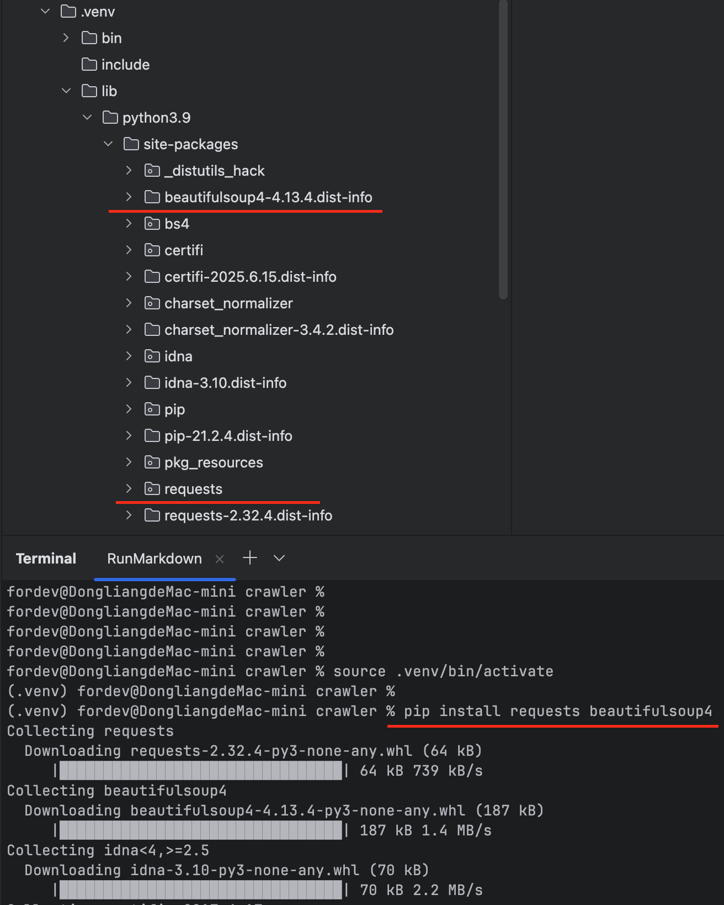
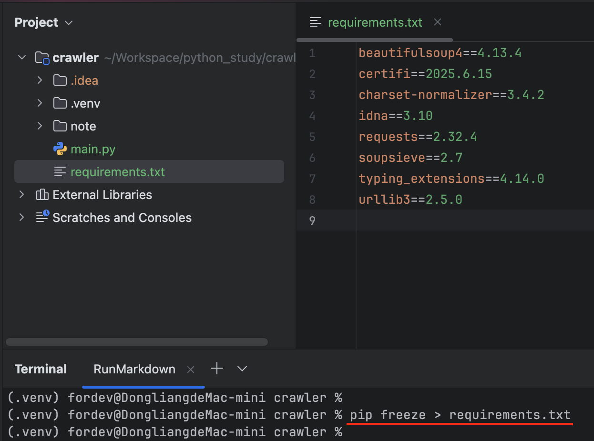

### 创建一个python虚拟环境

```bash
python3 -m venv .venv
```

执行完这个命令后，会在当前目录下创建一个`.venv`文件夹，其目录结构如下图所示：



其中包含了pip和python的执行环境以及依赖的lib。

使用虚拟环境是Python项目开发中的最佳实践，这样项目就拥有了自己独立的python&pip的执行环境，在虚拟环境中自由安装任何包，而无需担心影响系统的Python环境。

### 激活虚拟环境

执行如下命令激活一个虚拟环境：

```bash
source .venv/bin/activate
```

执行完这个命令后，命令行中的提示符前面会多一个`(.venv)`。



这意味着后续执行的所有命令都**只会**影响虚拟环境，而不会影响系统中的python环境。

执行如下命令安装`requests`和`beautifulsoup4`两个lib：

```bash
pip install requests beautifulsoup4
```

这两个lib会安装在虚拟环境中，路径是`.venv/lib/python3.9/site-packages`：



### 生成依赖文件requirements.txt

不要将`.venv`文件夹中的内容提交到VCS，通过如下命令记录该项目的所有依赖：

```bash
pip freeze > requirements.txt
```



其他人从git中clone下代码之后，只需执行如下步骤就可以恢复整个执行环境：

```bash
python3 -m venv .venv
source .venv/bin/activate 
pip install -r requirements.txt # 安装requirements.txt中所有的依赖
```


